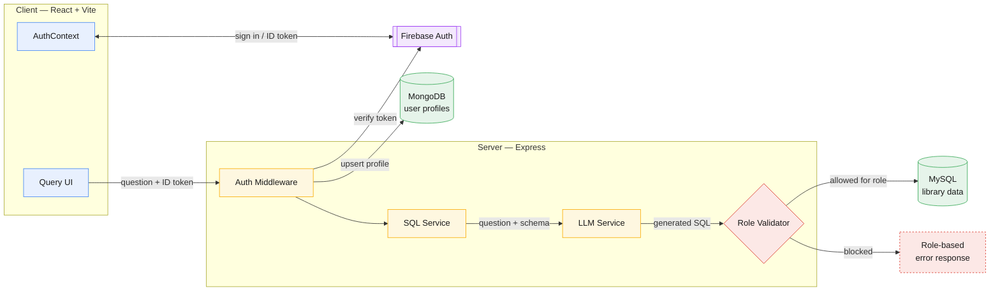

# SpeakSQL


SpeakSQL lets authenticated users ask natural-language questions and get back results from a MySQL database. A backend service turns the question into SQL using allowlist-based query filtering, checks the generated query against the user's role, and runs it against the database. Firebase handles authentication; MongoDB stores user profiles and roles.

---

## Table of Contents

- [SpeakSQL](#speaksql)
  - [Table of Contents](#table-of-contents)
  - [Overview](#overview)
  - [Features](#features)
  - [Tech Stack](#tech-stack)
  - [Architecture](#architecture)
  - [How It Works](#how-it-works)
  - [Project Structure](#project-structure)
  - [Getting Started](#getting-started)
    - [Prerequisites](#prerequisites)
    - [Clone](#clone)
    - [Backend](#backend)
    - [Frontend](#frontend)
  - [Environment Variables](#environment-variables)
    - [Server](#server)
    - [Client](#client)
  - [Roles \& Permissions](#roles--permissions)
  - [API Reference](#api-reference)
  - [Security](#security)
  - [Docker](#docker)
  - [Testing](#testing)
  - [CI/CD](#cicd)
  - [Health Check](#health-check)
  - [Deployment](#deployment)
  - [License](#license)
  - [Author](#author)

---

## Overview

The application is built around a library-style relational dataset in MySQL. Users log in through Firebase, ask a question in plain English, and the backend generates and validates the corresponding SQL before executing it. MongoDB is not queried by the natural-language pipeline - it only stores user profiles and role information linked to each Firebase account.

- **Client**: React single-page app with route-based pages and Material UI.
- **Server**: Express app with route handlers, controllers, middleware, services, and config modules.

---

## Features

- Natural-language questions converted to SQL through the Gemini API, using the live database schema as context
- Firebase Authentication (email/password and Google sign-in), with ID tokens verified server-side via the Firebase Admin SDK
- Role-based access control (`USER`, `STAFF`, `ADMIN`) enforced at both the middleware and route level
- Every generated SQL statement is checked against the requesting user's role before execution; malicious queries and common injection patterns are rejected outright
- Table browser scoped to the tables a role is allowed to read, with client-side caching to avoid repeat fetches
- Admin panel for listing users, changing roles, and deleting accounts
- MongoDB-backed user profile storage, upserted automatically after each successful Firebase login
- Health check endpoint reporting server, MongoDB, and MySQL connectivity
- Dockerized backend with automated CI via GitHub Actions
- Frontend deploys to Vercel, backend deploys to Render

---

## Tech Stack

**Frontend**
- React 19
- Vite
- React Router
- Material UI (MUI)
- Firebase Client SDK

**Backend**
- Node.js
- Express.js
- Firebase Admin SDK
- Gemini API

**Databases**
- MySQL (`mysql2/promise`)
- MongoDB Atlas (Mongoose)

**DevOps**
- Docker
- GitHub Actions
- Render (backend)
- Vercel (frontend)

---

## Architecture


---

## How It Works

1. The client sends a natural-language question to the backend, along with the user's Firebase ID token.
2. `auth.js` middleware verifies the token and attaches the resolved user (including role) to the request.
3. The controller passes the question to `sqlService.js`, which runs the NLQ pipeline.
4. `sqlService.js` calls `llmService.js`, which generates SQL from the question and the current database schema.
5. `roleValidator.js` checks the generated SQL against the user's role and blocks disallowed tables, operations, injection patterns, or multi-statement queries.
6. If allowed, the query runs against MySQL and the results are returned to the client.
7. If blocked, the server returns a role-based error instead of executing anything.

---

## Project Structure

```text
speak-sql/
├── client/
│   └── src/
│       ├── App.jsx                # app shell, routes, protected routes
│       ├── firebase.js            # Firebase client initialization
│       ├── context/
│       │   └── AuthContext.jsx    # auth state, login/register/logout
│       ├── services/
│       │   └── api.js             # centralized API client
│       ├── pages/
│       │   ├── HomePage.jsx       # natural-language query UI
│       │   ├── TablesPage.jsx     # table browser
│       │   └── AdminPanel.jsx     # admin-only user management
│       └── components/
│           └── Navbar.jsx         # role-aware navigation
│
└── server/
    ├── app.js                     # Express app, CORS, routes, error handling
    ├── server.js                  # startup: connects MongoDB & MySQL, starts app
    ├── routes/                    # auth, admin, health, query routes
    ├── controllers/               # request-handler logic
    ├── middleware/
    │   ├── auth.js                # Firebase token verification
    │   └── roleValidator.js       # role permissions + SQL validation
    ├── services/
    │   ├── sqlService.js          # NLQ pipeline orchestration
    │   └── llmService.js          # Gemini-based SQL generation
    ├── config/
    │   ├── db.js                  # MySQL pool
    │   └── mongodb.js             # MongoDB connection
    ├── models/
    │   └── User.js                # Mongoose user schema
    ├── utils/                     # schema extraction helpers
    ├── tests/                     # Vitest + Supertest
    └── Dockerfile
```

---

## Getting Started

### Prerequisites

- Node.js 18 or later
- A MySQL instance with the library dataset schema loaded
- A MongoDB instance (Atlas or local)
- A Firebase project with Authentication enabled
- A Gemini API key

### Clone

```bash
git clone https://github.com/devansh436/speak-sql.git
cd speak-sql
```

### Backend

```bash
cd server
npm install
cp .env.example .env   # fill in the values listed below
npm run dev
```
****
### Frontend

```bash
cd client
npm install
cp .env.example .env   # fill in the values listed below
npm run dev
```

---

## Environment Variables

### Server

| Variable | Description |
|---|---|
| `DATABASE_URL` | MySQL connection string / pool configuration |
| `MONGODB_URI` | MongoDB connection string |
| `FIREBASE_PROJECT_ID` | Firebase project ID |
| `FIREBASE_CLIENT_EMAIL` | Firebase service account client email |
| `FIREBASE_PRIVATE_KEY` | Firebase service account private key |
| `GEMINI_API_KEY` | API key for the Gemini model |
| `PORT` | Optional. Defaults to `5000` |

### Client

| Variable | Description |
|---|---|
| `VITE_API_URL` | Base URL of the backend API |
| `VITE_FIREBASE_API_KEY` | Firebase client API key |
| `VITE_FIREBASE_AUTH_DOMAIN` | Firebase auth domain |
| `VITE_FIREBASE_PROJECT_ID` | Firebase project ID |
| `VITE_FIREBASE_STORAGE_BUCKET` | Firebase storage bucket |
| `VITE_FIREBASE_MESSAGING_SENDER_ID` | Firebase messaging sender ID |
| `VITE_FIREBASE_APP_ID` | Firebase app ID |

---

## Roles & Permissions

| Role | Books | Members | Transactions | Staff | Schema Changes |
|---|---|---|---|---|---|
| `USER` | Read | - | - | - | - |
| `STAFF` | Read / Write | Read / Write | Read / Write | - | - |
| `ADMIN` | Full | Full | Full | Full | Yes |

Roles are stored in MongoDB and used for both query restrictions and admin access. The validator also rejects common SQL injection patterns and multi-statement SQL regardless of role.

Admin can change roles of users via a panel displayed only to Admin

---

## API Reference

| Method | Endpoint | Auth | Description |
|---|---|---|---|
| POST | `/api/query` | Required | Runs a natural-language question through the NLQ pipeline and returns results |
| GET | `/api/schema` | Required | Returns schema information scoped to the current role |
| GET | `/api/permissions` | Required | Returns the current user's role permissions |
| GET | `/api/tables` | Required | Returns table data accessible to the current role |
| GET | `/api/auth/me` | Required | Returns the authenticated user's profile |
| GET | `/api/auth/permissions` | Required | Returns the authenticated user's permissions |
| GET | `/api/auth/status` | None | Returns Firebase Admin configuration status |
| GET | `/api/health` | None | Returns server, MongoDB, and MySQL health info |
| GET | `/api/admin/users` | Admin | Lists all users |
| PATCH | `/api/admin/users/:userId/role` | Admin | Updates a user's role |
| DELETE | `/api/admin/users/:userId` | Admin | Deletes a user |
| GET | `/api/admin/stats` | Admin | Returns user statistics |

---

## Security

- Firebase ID tokens are verified on every protected request via the Firebase Admin SDK.
- Role-based access control (RBAC) is enforced at both the middleware and SQL validation layers.
- Allowlist-based table and operation filtering prevents queries from accessing unauthorized resources.
- Multi-statement queries are rejected before execution.
- Common SQL injection patterns are detected and blocked by the validator, independent of user role.
- Database schema is supplied to the LLM at runtime, while query execution remains server-controlled.
- User roles are stored separately in MongoDB and never trusted from client-provided data.
  
---

## Docker

Build:

```bash
docker build -t speak-sql-backend .
```

Run:

```bash
docker run --env-file .env -p 5000:5000 speak-sql-backend
```

---

## Testing

Run inside `server/`:

```bash
npm run test:run       # run all tests
npm run test:coverage  # run tests with coverage
npm run lint           # run ESLint
```

Tests are written with Vitest and Supertest.

---

## CI/CD

GitHub Actions runs on every push:

- Installs dependencies
- Runs ESLint
- Executes backend tests

Pushes to the production branch trigger deployment:

- **Frontend → Vercel**
- **Backend → Render**

---

## Health Check

```http
GET /api/health
```

Example response:

```json
{
  "status": "healthy",
  "server": "running",
  "mongodb": "connected",
  "mysql": "connected"
}
```

---

## Deployment

| Service | Platform |
|---|---|
| Frontend | Vercel |
| Backend | Render (Docker) |
| MySQL | Aiven Cloud |
| MongoDB | MongoDB Atlas |
| Authentication | Firebase Auth |
| AI | Gemini API |

---

## License

Licensed under the MIT License.

---

## Author

**Devansh**
GitHub: [@devansh436](https://github.com/devansh436)